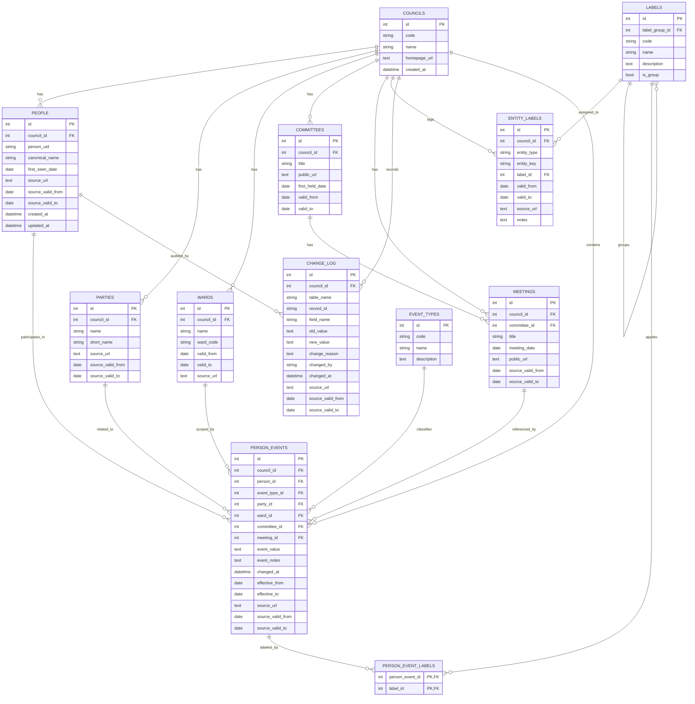

# Relational Schema

This document defines the proposed canonical SQLite schema for the project. The structure is intentionally clean and multi-council ready, while keeping core entities normalized and keeping labels flexible for future classification.

## Design Goals

- One canonical person record per candidate
- Multi-council support from the start
- Temporal history for changes and validity windows
- Public-source traceability on records that originate from external pages
- Flexible labels for analysis and reporting without hard-coding every category

## Core Model



## How the model is intended to work

- `people` holds one canonical person record per candidate/person identifier.
- `wards`, `parties`, and `committees` remain first-class entities because they have identity, dates, and relationships.
- `labels` is the flexible classification layer.
- `label_group_id` allows labels to be arranged into an N-tier hierarchy.
- `entity_labels` provides many-to-many tagging with validity windows, source links, and notes.
- `person_events` stores the change timeline for elections, councillor status, declarations, meetings, committee membership, surgery changes, absence reasons, and similar events.
- `change_log` records field-level updates for auditability and historic reporting.

## Seeded baseline data

The current initializer seeds:

- Birmingham City Council as the first council
- 9 event types
- 4 top-level label groups

## Initialization

```powershell
python scripts/init_database.py
```

The default SQLite file is `output/data/monitoring.sqlite`.

## Future expansion

This structure is designed to support future councils and alternative public data sources by adding another `councils` row and loading source-specific records under that council namespace.
